## Flowers
### CNN v1
0.6418181657791138
```python
model = Sequential([
    Conv2D(32, (3, 3), activation='relu', input_shape=(128, 128, 3)),
    MaxPooling2D((2, 2)),

    Conv2D(64, (3, 3), activation='relu'),
    MaxPooling2D((2, 2)),

    Conv2D(32, (3, 3), activation='relu'),
    MaxPooling2D((2, 2)),

    Flatten(),
    Dense(1024, activation='relu'),
    Dense(512, activation='relu'),
    Dense(512, activation='relu'),
    Dense(len(class_names), activation='softmax')
])
```
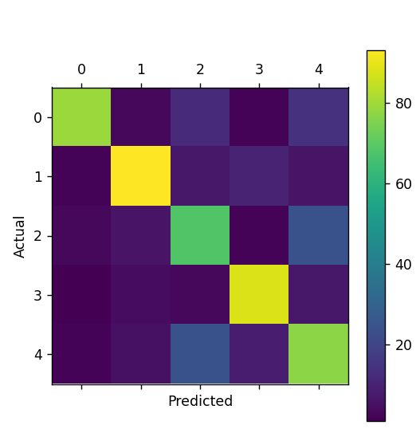


### cnn v2
```python
    Flatten(),
    Dense(1024, activation='relu'),
    Dropout(0.5),  # 첫 번째 Dense 레이어 뒤에 Dropout 추가

    Dense(512, activation='relu'),
    Dropout(0.5),  # 두 번째 Dense 레이어 뒤에 Dropout 추가

    Dense(512, activation='relu'),
    Dropout(0.5),  # 세 번째 Dense 레이어 뒤에 Dropout 추가

hist = model.fit(X_train, train_labels,
                 epochs=20, validation_split=0.25)
```
```text
Epoch 1/20
52/52 ━━━━━━━━━━━━━━━━━━━━ 88s 2s/step - accuracy: 0.2099 - loss: 5.5953 - val_accuracy: 0.3224 - val_loss: 1.5743
Epoch 2/20
52/52 ━━━━━━━━━━━━━━━━━━━━ 91s 2s/step - accuracy: 0.2690 - loss: 1.6078 - val_accuracy: 0.2568 - val_loss: 1.5903
Epoch 3/20
52/52 ━━━━━━━━━━━━━━━━━━━━ 92s 2s/step - accuracy: 0.3089 - loss: 1.5529 - val_accuracy: 0.3352 - val_loss: 1.5290
Epoch 4/20
52/52 ━━━━━━━━━━━━━━━━━━━━ 119s 2s/step - accuracy: 0.5659 - loss: 1.1619 - val_accuracy: 0.3279 - val_loss: 1.7555
Epoch 5/20
52/52 ━━━━━━━━━━━━━━━━━━━━ 128s 2s/step - accuracy: 0.8557 - loss: 0.4517 - val_accuracy: 0.3588 - val_loss: 2.7851
Epoch 6/20
52/52 ━━━━━━━━━━━━━━━━━━━━ 120s 2s/step - accuracy: 0.9580 - loss: 0.1713 - val_accuracy: 0.3097 - val_loss: 3.7999
Epoch 7/20
52/52 ━━━━━━━━━━━━━━━━━━━━ 118s 2s/step - accuracy: 0.9744 - loss: 0.1093 - val_accuracy: 0.3406 - val_loss: 4.3282
Epoch 8/20
52/52 ━━━━━━━━━━━━━━━━━━━━ 119s 2s/step - accuracy: 0.9861 - loss: 0.0767 - val_accuracy: 0.3515 - val_loss: 4.0841
Epoch 9/20
52/52 ━━━━━━━━━━━━━━━━━━━━ 119s 2s/step - accuracy: 0.9923 - loss: 0.0304 - val_accuracy: 0.3515 - val_loss: 3.8593
Epoch 10/20
52/52 ━━━━━━━━━━━━━━━━━━━━ 119s 2s/step - accuracy: 0.9901 - loss: 0.0352 - val_accuracy: 0.3534 - val_loss: 6.2481
Epoch 11/20
52/52 ━━━━━━━━━━━━━━━━━━━━ 120s 2s/step - accuracy: 0.9891 - loss: 0.0463 - val_accuracy: 0.3279 - val_loss: 5.2481
Epoch 12/20
52/52 ━━━━━━━━━━━━━━━━━━━━ 120s 2s/step - accuracy: 0.9895 - loss: 0.0446 - val_accuracy: 0.3424 - val_loss: 4.8252
Epoch 13/20
52/52 ━━━━━━━━━━━━━━━━━━━━ 120s 2s/step - accuracy: 0.9857 - loss: 0.0466 - val_accuracy: 0.3169 - val_loss: 6.7459
Epoch 14/20
52/52 ━━━━━━━━━━━━━━━━━━━━ 122s 2s/step - accuracy: 0.9939 - loss: 0.0307 - val_accuracy: 0.3242 - val_loss: 3.7598
Epoch 15/20
52/52 ━━━━━━━━━━━━━━━━━━━━ 119s 2s/step - accuracy: 0.9851 - loss: 0.0339 - val_accuracy: 0.3333 - val_loss: 5.4544
Epoch 16/20
52/52 ━━━━━━━━━━━━━━━━━━━━ 119s 2s/step - accuracy: 0.9956 - loss: 0.0540 - val_accuracy: 0.3169 - val_loss: 5.5170
Epoch 17/20
52/52 ━━━━━━━━━━━━━━━━━━━━ 120s 2s/step - accuracy: 0.9882 - loss: 0.0289 - val_accuracy: 0.3169 - val_loss: 6.3567
Epoch 18/20
52/52 ━━━━━━━━━━━━━━━━━━━━ 120s 2s/step - accuracy: 0.9965 - loss: 0.0108 - val_accuracy: 0.3151 - val_loss: 7.9157
Epoch 19/20
52/52 ━━━━━━━━━━━━━━━━━━━━ 111s 2s/step - accuracy: 0.9981 - loss: 0.0049 - val_accuracy: 0.2750 - val_loss: 7.5833
Epoch 20/20
52/52 ━━━━━━━━━━━━━━━━━━━━ 86s 2s/step - accuracy: 0.9965 - loss: 0.0315 - val_accuracy: 0.3406 - val_loss: 6.9134
18/18 - 4s - 235ms/step - accuracy: 0.2782 - loss: 7.8872
테스트 정확도: 0.2781818211078644
1/1 ━━━━━━━━━━━━━━━━━━━━ 0s 161ms/step
예측값 = [2 3 4 4 3 4 1 1 2 2 1 3 4 0 3 2 1 1 1 1 2 4 3 3 1]
실제값 = [2 4 3 2 4 4 4 1 1 0 1 4 4 0 3 2 2 2 0 2 1 0 4 4 2]
```
* 과대적합!!!!!
* 학습하는데 시간도 굉장히 오래 걸렸음 
* 정확도도 매우 낮음 
* 에폭을 줄여볼까?
* 하이퍼파라미터를 계속 변경해도 정확도에는 영향을 미치지 못함 -> 아예 다른 게 원인인가?
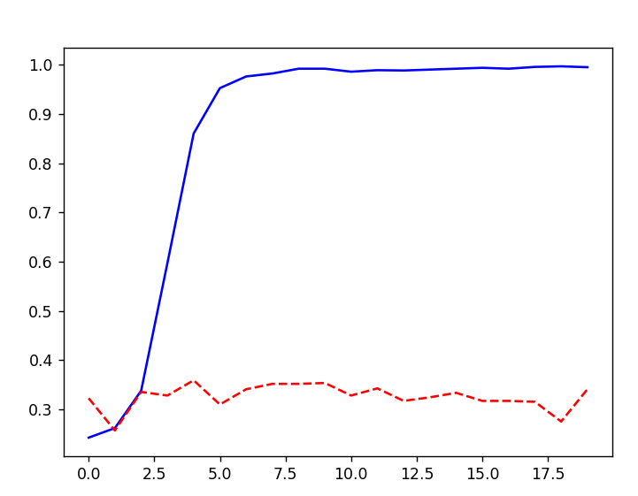
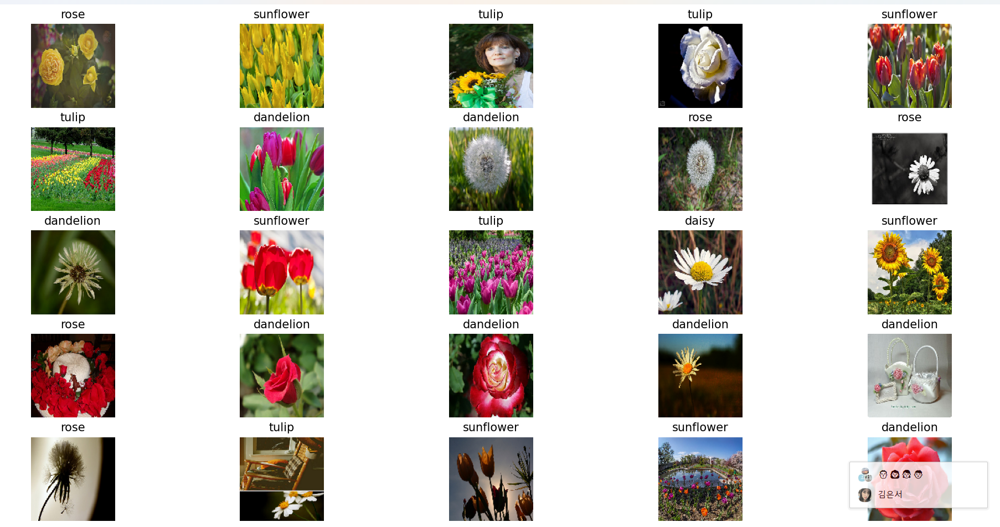
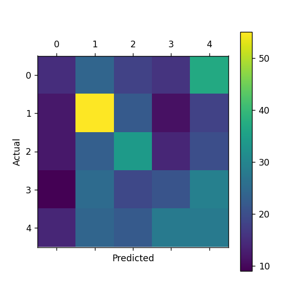

### cnn v3
* 과대적합이 되지 않도록 단순화해보기 (에폭 줄여보기)
* 다른 방법?
* 데이터 증강?
* 하이퍼파라미터 변경해보기?
```python
# 데이터 증강
datagen = ImageDataGenerator(
    rotation_range=20,
    width_shift_range=0.2,
    height_shift_range=0.2,
    shear_range=0.2,
    zoom_range=0.2,
    horizontal_flip=True,
    fill_mode='nearest'
)

datagen.fit(X_train)

# 증강된 데이터를 사용한 학습
hist = model.fit(datagen.flow(X_train, train_labels, batch_size=16),
                 epochs=15, validation_data=(X_test, test_labels))
```
```python
# CNN 모델 정의
model = Sequential([
    Conv2D(32, (3, 3), activation='relu', input_shape=(128, 128, 3)),
    MaxPooling2D((2, 2)),

    Conv2D(64, (3, 3), activation='relu'),
    MaxPooling2D((2, 2)),

    Conv2D(32, (3, 3), activation='relu'),
    MaxPooling2D((2, 2)),

    Flatten(),
    Dense(512, activation='relu'),
    Dropout(0.5),
    Dense(256, activation='relu'),
    Dense(len(class_names), activation='softmax')
])

# 증강된 데이터를 사용한 학습
hist = model.fit(datagen.flow(X_train, train_labels, batch_size=16),
                 epochs=100, validation_data=(X_test, test_labels))
```
```text
Epoch 1/15
138/138 ━━━━━━━━━━━━━━━━━━━━ 20s 133ms/step - accuracy: 0.3092 - loss: 1.6190 - val_accuracy: 0.4709 - val_loss: 1.2630
Epoch 2/15
138/138 ━━━━━━━━━━━━━━━━━━━━ 9s 64ms/step - accuracy: 0.4337 - loss: 1.2419 - val_accuracy: 0.5964 - val_loss: 0.9903
Epoch 3/15
138/138 ━━━━━━━━━━━━━━━━━━━━ 9s 64ms/step - accuracy: 0.5720 - loss: 1.0475 - val_accuracy: 0.6418 - val_loss: 0.9351
Epoch 4/15
138/138 ━━━━━━━━━━━━━━━━━━━━ 9s 64ms/step - accuracy: 0.6166 - loss: 0.9621 - val_accuracy: 0.6473 - val_loss: 0.8755
Epoch 5/15
138/138 ━━━━━━━━━━━━━━━━━━━━ 10s 71ms/step - accuracy: 0.6360 - loss: 0.9362 - val_accuracy: 0.7036 - val_loss: 0.8100
Epoch 6/15
138/138 ━━━━━━━━━━━━━━━━━━━━ 10s 76ms/step - accuracy: 0.6577 - loss: 0.8812 - val_accuracy: 0.6873 - val_loss: 0.8365
Epoch 7/15
138/138 ━━━━━━━━━━━━━━━━━━━━ 10s 74ms/step - accuracy: 0.6494 - loss: 0.8754 - val_accuracy: 0.6891 - val_loss: 0.8213
Epoch 8/15
138/138 ━━━━━━━━━━━━━━━━━━━━ 10s 74ms/step - accuracy: 0.6663 - loss: 0.8250 - val_accuracy: 0.6836 - val_loss: 0.8024
Epoch 9/15
138/138 ━━━━━━━━━━━━━━━━━━━━ 10s 73ms/step - accuracy: 0.6798 - loss: 0.8085 - val_accuracy: 0.6200 - val_loss: 1.2022
Epoch 10/15
138/138 ━━━━━━━━━━━━━━━━━━━━ 10s 74ms/step - accuracy: 0.6944 - loss: 0.7959 - val_accuracy: 0.7418 - val_loss: 0.7704
Epoch 11/15
138/138 ━━━━━━━━━━━━━━━━━━━━ 10s 74ms/step - accuracy: 0.7086 - loss: 0.7737 - val_accuracy: 0.7164 - val_loss: 0.7511
Epoch 12/15
138/138 ━━━━━━━━━━━━━━━━━━━━ 10s 75ms/step - accuracy: 0.7201 - loss: 0.7356 - val_accuracy: 0.7145 - val_loss: 0.7716
Epoch 13/15
138/138 ━━━━━━━━━━━━━━━━━━━━ 10s 74ms/step - accuracy: 0.6952 - loss: 0.7400 - val_accuracy: 0.7400 - val_loss: 0.7186
Epoch 14/15
138/138 ━━━━━━━━━━━━━━━━━━━━ 10s 74ms/step - accuracy: 0.7208 - loss: 0.7250 - val_accuracy: 0.7255 - val_loss: 0.8159
Epoch 15/15
138/138 ━━━━━━━━━━━━━━━━━━━━ 10s 74ms/step - accuracy: 0.7240 - loss: 0.7006 - val_accuracy: 0.7364 - val_loss: 0.6979
18/18 - 1s - 51ms/step - accuracy: 0.7364 - loss: 0.6979
테스트 정확도: 0.7363636493682861
1/1 ━━━━━━━━━━━━━━━━━━━━ 0s 175ms/step
예측값 = [4 1 3 2 4 4 4 1 4 0 1 2 4 0 3 2 2 2 1 2 1 0 2 4 2]
실제값 = [2 4 3 2 4 4 4 1 1 0 1 4 4 0 3 2 2 2 0 2 1 0 4 4 2]

```
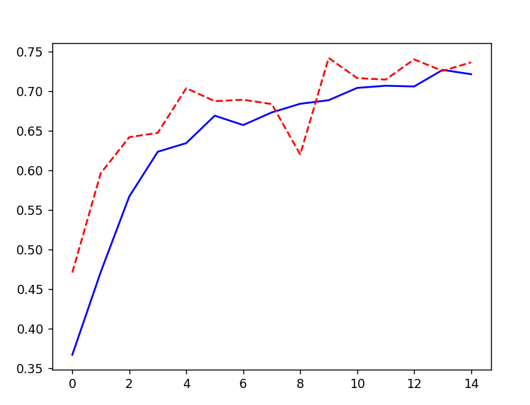
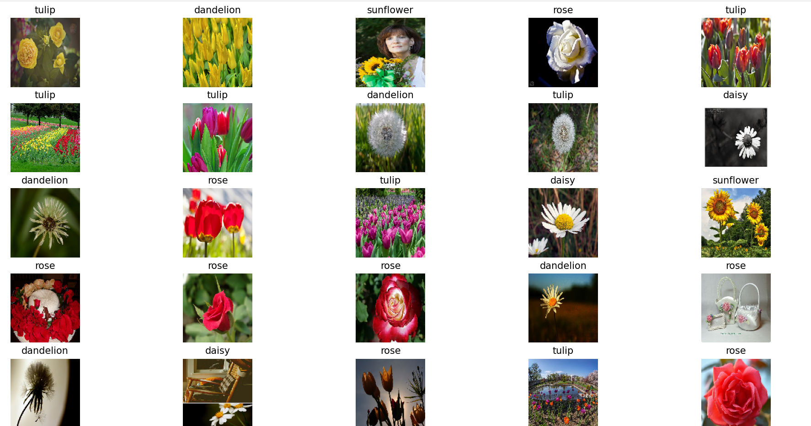

* 그래프가 상승 폭이라, epoch를 늘려본다면?
* 증강 후 정확도 확실히 높아짐

### cnn v4
```python
# CNN 모델 정의
model = Sequential([
    Conv2D(32, (3, 3), activation='relu', input_shape=(128, 128, 3)),
    MaxPooling2D((2, 2)),

    Conv2D(64, (3, 3), activation='relu'),
    MaxPooling2D((2, 2)),

    Conv2D(32, (3, 3), activation='relu'),
    MaxPooling2D((2, 2)),

    Flatten(),
    Dense(512, activation='relu'),
    Dropout(0.5),
    Dense(256, activation='relu'),
    Dense(len(class_names), activation='softmax')
])

# 증강된 데이터를 사용한 학습
hist = model.fit(datagen.flow(X_train, train_labels, batch_size=16),
                 epochs=100, validation_data=(X_test, test_labels))
```
* 에폭 100으로 증가 
* 그래프가 상승폭인데, 에폭을 더 늘려보면?
```text
# 생략 
138/138 ━━━━━━━━━━━━━━━━━━━━ 20s 143ms/step - accuracy: 0.8415 - loss: 0.4202 - val_accuracy: 0.7873 - val_loss: 0.6488
Epoch 89/100
138/138 ━━━━━━━━━━━━━━━━━━━━ 20s 143ms/step - accuracy: 0.8507 - loss: 0.4030 - val_accuracy: 0.7800 - val_loss: 0.6892
Epoch 90/100
138/138 ━━━━━━━━━━━━━━━━━━━━ 20s 145ms/step - accuracy: 0.8470 - loss: 0.3922 - val_accuracy: 0.7855 - val_loss: 0.6276
Epoch 91/100
138/138 ━━━━━━━━━━━━━━━━━━━━ 19s 135ms/step - accuracy: 0.8430 - loss: 0.4077 - val_accuracy: 0.8109 - val_loss: 0.6768
Epoch 92/100
138/138 ━━━━━━━━━━━━━━━━━━━━ 14s 97ms/step - accuracy: 0.8339 - loss: 0.4253 - val_accuracy: 0.7927 - val_loss: 0.7247
Epoch 93/100
138/138 ━━━━━━━━━━━━━━━━━━━━ 11s 82ms/step - accuracy: 0.8401 - loss: 0.3769 - val_accuracy: 0.7673 - val_loss: 0.8014
Epoch 94/100
138/138 ━━━━━━━━━━━━━━━━━━━━ 11s 79ms/step - accuracy: 0.8452 - loss: 0.4356 - val_accuracy: 0.7855 - val_loss: 0.6541
Epoch 95/100
138/138 ━━━━━━━━━━━━━━━━━━━━ 11s 80ms/step - accuracy: 0.8567 - loss: 0.3763 - val_accuracy: 0.7927 - val_loss: 0.6447
Epoch 96/100
138/138 ━━━━━━━━━━━━━━━━━━━━ 11s 79ms/step - accuracy: 0.8498 - loss: 0.3964 - val_accuracy: 0.7964 - val_loss: 0.6446
Epoch 97/100
138/138 ━━━━━━━━━━━━━━━━━━━━ 11s 81ms/step - accuracy: 0.8328 - loss: 0.4365 - val_accuracy: 0.8018 - val_loss: 0.6190
Epoch 98/100
138/138 ━━━━━━━━━━━━━━━━━━━━ 11s 79ms/step - accuracy: 0.8412 - loss: 0.4117 - val_accuracy: 0.7873 - val_loss: 0.7034
Epoch 99/100
138/138 ━━━━━━━━━━━━━━━━━━━━ 11s 80ms/step - accuracy: 0.8479 - loss: 0.3972 - val_accuracy: 0.7982 - val_loss: 0.6501
Epoch 100/100
138/138 ━━━━━━━━━━━━━━━━━━━━ 10s 70ms/step - accuracy: 0.8600 - loss: 0.3783 - val_accuracy: 0.8036 - val_loss: 0.7379
18/18 - 0s - 15ms/step - accuracy: 0.8036 - loss: 0.7379
테스트 정확도: 0.803636372089386
1/1 ━━━━━━━━━━━━━━━━━━━━ 0s 67ms/step
예측값 = [1 4 3 2 4 4 4 1 4 0 1 4 4 0 3 2 2 2 1 2 0 0 4 4 2]
실제값 = [2 4 3 2 4 4 4 1 1 0 1 4 4 0 3 2 2 2 0 2 1 0 4 4 2]
```
* 확실히 정확도느 증가함 
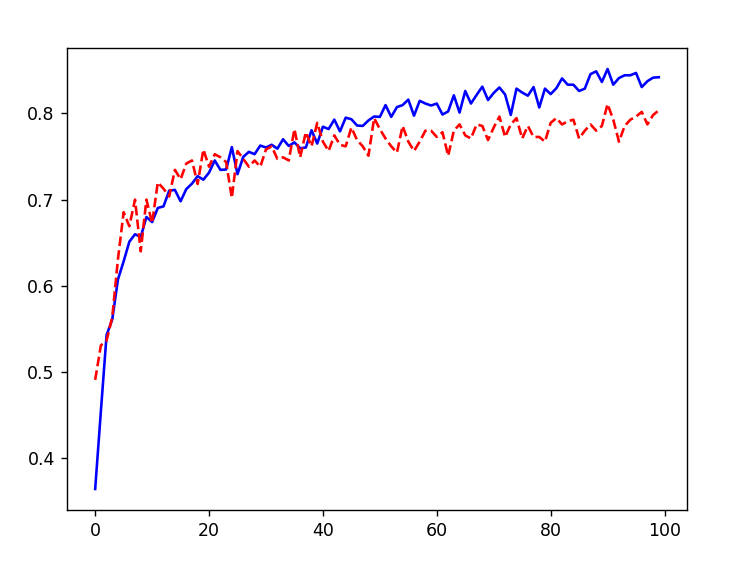
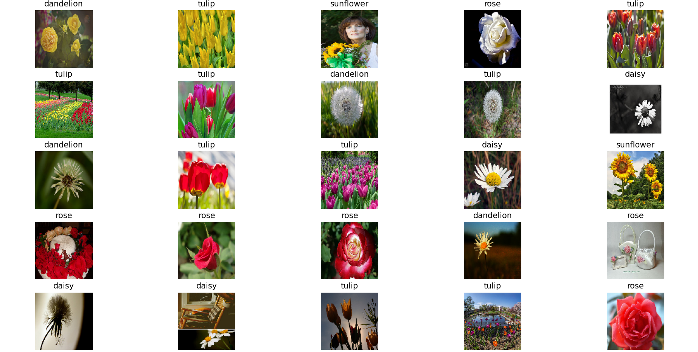
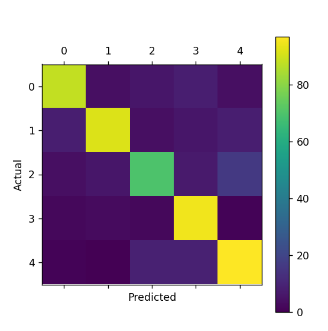

###  cnn v5
```python
# 증강된 데이터를 사용한 학습
hist = model.fit(datagen.flow(X_train, train_labels, batch_size=16),
                 epochs=150, validation_data=(X_test, test_labels))
```
* 에폭 증가 (100 -> 150)
* 손실도 함께 출력하기 위해 출력 형태 변경 
* 이전에 비해 정확도가 높아지지 않음 (다시 뒤로..)
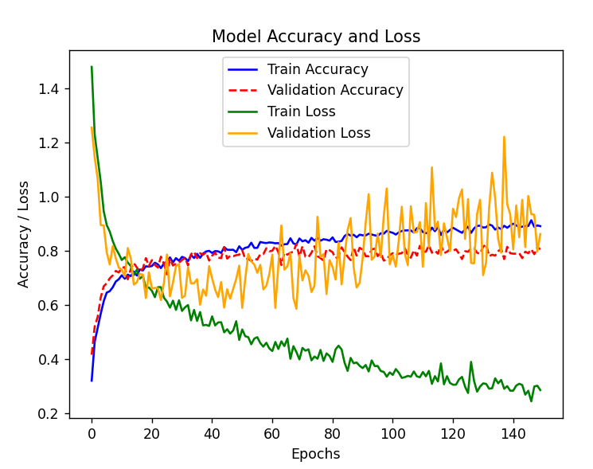
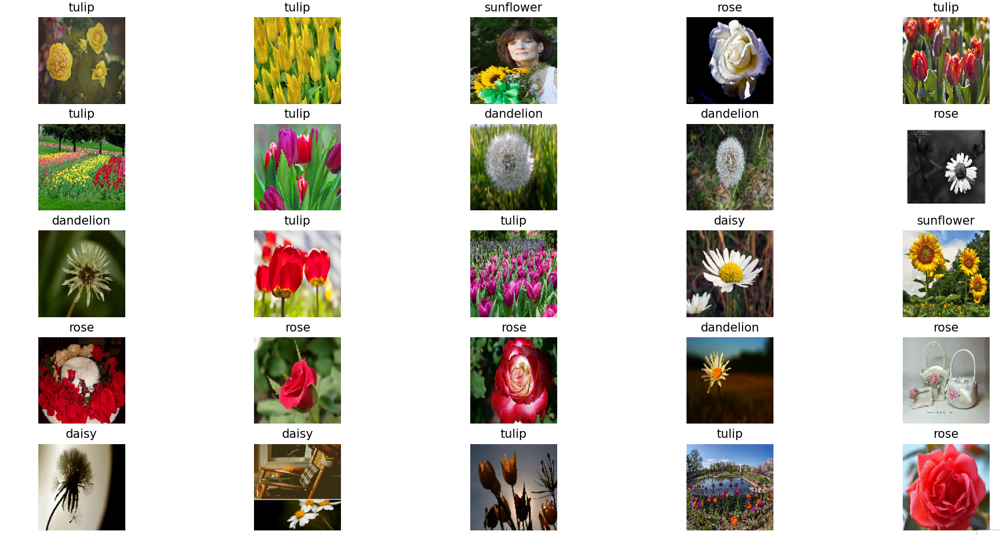
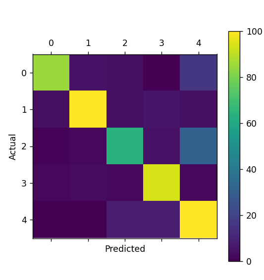
```text
Epoch 150/150
138/138 ━━━━━━━━━━━━━━━━━━━━ 7s 49ms/step - accuracy: 0.8880 - loss: 0.2849 - val_accuracy: 0.8055 - val_loss: 0.8615
18/18 - 0s - 17ms/step - accuracy: 0.8055 - loss: 0.8615
테스트 정확도: 0.8054545521736145
1/1 ━━━━━━━━━━━━━━━━━━━━ 0s 63ms/step
예측값 = [4 4 3 2 4 4 4 1 1 2 1 4 4 0 3 2 2 2 1 2 0 0 4 4 2]
실제값 = [2 4 3 2 4 4 4 1 1 0 1 4 4 0 3 2 2 2 0 2 1 0 4 4 2]

```