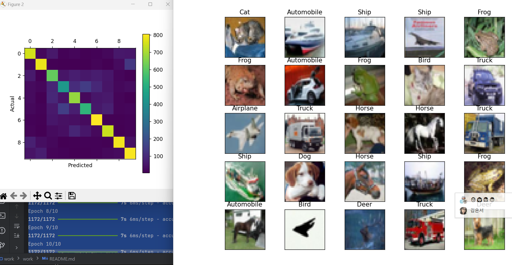
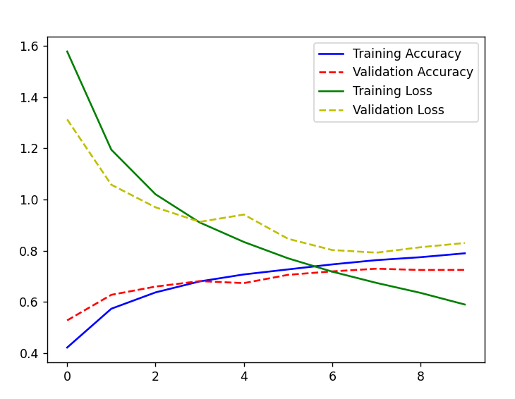
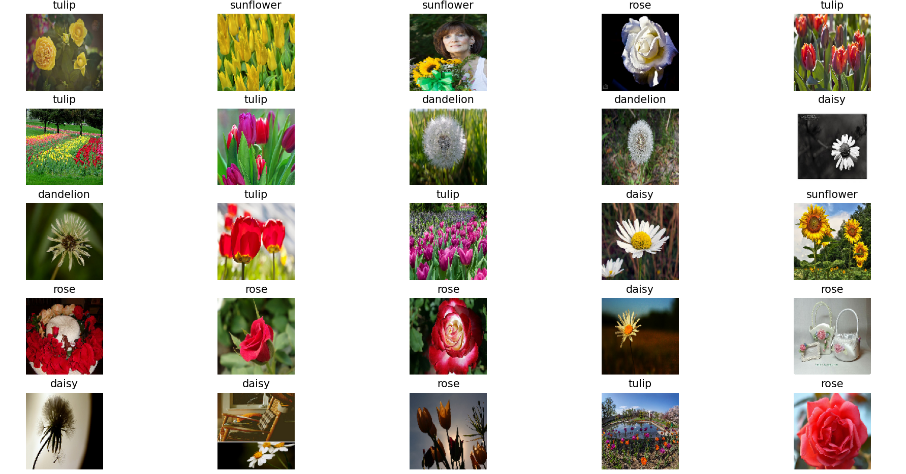

## cifar
### cnn v1
```python
model = keras.models.Sequential( [
    keras.layers.Conv2D(input_shape = (32, 32, 3),
                        kernel_size = (3,3), padding = 'same',
                        filters = 32),
    keras.layers.MaxPooling2D((2, 2), strides=2),
    keras.layers.Conv2D(kernel_size = (3,3), padding ='same',
                        filters = 64),
    keras.layers.MaxPooling2D((2, 2), strides=2),
    keras.layers.Conv2D(kernel_size = (3,3), padding = 'same',
                        filters = 32),
    keras.layers.Flatten(),
    keras.layers.Dense(128, activation = 'relu'),
    keras.layers.Dense(32, activation = 'relu'),
    keras.layers.Dense(10, activation = 'softmax'),
])
```
* 정확도 낮음 


### cnn v2
```python
model = keras.models.Sequential( [
    keras.layers.Conv2D(input_shape = (32, 32, 3),
                        kernel_size = (3,3), padding = 'same',
                        filters = 32),
    keras.layers.MaxPooling2D((2, 2)Zz),
    keras.layers.Conv2D(kernel_size = (3,3), padding ='same',
                        filters = 64),
    keras.layers.MaxPooling2D((2, 2)),
    keras.layers.Conv2D(kernel_size = (3,3), padding = 'same',
                        filters = 32),
    keras.layers.MaxPooling2D((2, 2)),

    keras.layers.Flatten(),
    keras.layers.Dense(512, activation = 'relu'),
    keras.layers.Dense(256, activation = 'relu'),
    keras.layers.Dense(10, activation = 'softmax'),
])
```
```text
Epoch 8/10
1172/1172 ━━━━━━━━━━━━━━━━━━━━ 7s 6ms/step - accuracy: 0.9312 - loss: 0.2042 - val_accuracy: 0.7017 - val_loss: 1.2690
Epoch 9/10
1172/1172 ━━━━━━━━━━━━━━━━━━━━ 8s 7ms/step - accuracy: 0.9399 - loss: 0.1688 - val_accuracy: 0.7053 - val_loss: 1.4147
Epoch 10/10
1172/1172 ━━━━━━━━━━━━━━━━━━━━ 8s 7ms/step - accuracy: 0.9528 - loss: 0.1421 - val_accuracy: 0.6979 - val_loss: 1.5618
313/313 - 1s - 3ms/step - accuracy: 0.6944 - loss: 1.6019
테스트 정확도: 0.6944000124931335
1/1 ━━━━━━━━━━━━━━━━━━━━ 0s 55ms/step
```
* 마찬가지로 정확도 매우 낮음 -> 과대적합 


### cnn v3
```python
# 데이터 증강
datagen = ImageDataGenerator(
    rotation_range=20,
    width_shift_range=0.2,
    height_shift_range=0.2,
    shear_range=0.2,
    zoom_range=0.2,
    horizontal_flip=True,
    fill_mode='nearest'
)

datagen.fit(X_train)
```
```text
1172/1172 ━━━━━━━━━━━━━━━━━━━━ 7s 6ms/step - accuracy: 0.9025 - loss: 0.2711 - val_accuracy: 0.6839 - val_loss: 1.2478
Epoch 8/10
1172/1172 ━━━━━━━━━━━━━━━━━━━━ 7s 6ms/step - accuracy: 0.9240 - loss: 0.2141 - val_accuracy: 0.7006 - val_loss: 1.2895
Epoch 9/10
1172/1172 ━━━━━━━━━━━━━━━━━━━━ 7s 6ms/step - accuracy: 0.9342 - loss: 0.1874 - val_accuracy: 0.6971 - val_loss: 1.3672
Epoch 10/10
1172/1172 ━━━━━━━━━━━━━━━━━━━━ 7s 6ms/step - accuracy: 0.9528 - loss: 0.1393 - val_accuracy: 0.6920 - val_loss: 1.5433
313/313 - 1s - 3ms/step - accuracy: 0.6919 - loss: 1.5497
```
* 데이터 증강을 해도 Flowers와 다르게 과대적합이 나옴 
* 에폭을 줄여볼까?



### cnn v4
```python
hist = model.fit(train_images, train_labels,
                 epochs=5, validation_split=0.25)
```
```text
1172/1172 ━━━━━━━━━━━━━━━━━━━━ 7s 6ms/step - accuracy: 0.7355 - loss: 0.7567 - val_accuracy: 0.6927 - val_loss: 0.9081
Epoch 4/5
1172/1172 ━━━━━━━━━━━━━━━━━━━━ 7s 6ms/step - accuracy: 0.7892 - loss: 0.5953 - val_accuracy: 0.7006 - val_loss: 0.9072
Epoch 5/5
1172/1172 ━━━━━━━━━━━━━━━━━━━━ 7s 6ms/step - accuracy: 0.8448 - loss: 0.4502 - val_accuracy: 0.7071 - val_loss: 0.9531
313/313 - 1s - 3ms/step - accuracy: 0.7033 - loss: 0.9512
테스트 정확도: 0.7032999992370605
```
* 정확도 올라감!


### cnn v5
```python
model = keras.models.Sequential([
    keras.layers.Conv2D(32, (3, 3), padding='same', activation='relu', input_shape=(32, 32, 3)),
    keras.layers.MaxPooling2D((2, 2)),

    keras.layers.Conv2D(64, (3, 3), padding='same', activation='relu'),
    keras.layers.MaxPooling2D((2, 2)),

    keras.layers.Conv2D(32, (3, 3), padding='same', activation='relu'),
    keras.layers.MaxPooling2D((2, 2)),

    keras.layers.Flatten(),
    keras.layers.Dense(512, activation='relu'),
    keras.layers.Dropout(0.5),
    keras.layers.Dense(10, activation='softmax')
])
```
* 모델의 복잡도를 낮추고 에폭을 늘려봄 
* dropout 추가 
* 정확도 상승!! (대략 71%대였는데..)
* 에폭을 늘려볼까?
```text
hist = model.fit(train_images, train_labels,
                 epochs=10, validation_split=0.25)
```



### cnn v6
hist = model.fit(train_images, train_labels,
                 epochs=15, validation_split=0.25)
```text
Epoch 14/15
1172/1172 ━━━━━━━━━━━━━━━━━━━━ 8s 7ms/step - accuracy: 0.8317 - loss: 0.4635 - val_accuracy: 0.7357 - val_loss: 0.8527
Epoch 15/15
1172/1172 ━━━━━━━━━━━━━━━━━━━━ 8s 7ms/step - accuracy: 0.8426 - loss: 0.4411 - val_accuracy: 0.7370 - val_loss: 0.8583
313/313 - 3s - 11ms/step - accuracy: 0.7279 - loss: 0.8908
테스트 정확도: 0.7279000282287598
예측값 = [3 8 8 0 6 6 1 2 3 1 0 9 5 7 9 8 5 3 8 6 7 0 4 9 4]
실제값 = [3 8 8 0 6 6 1 6 3 1 0 9 5 7 9 8 5 7 8 6 7 0 4 9 5]
```


++ 에폭 20으로 늘렸을 경우


```text
1172/1172 ━━━━━━━━━━━━━━━━━━━━ 8s 7ms/step - accuracy: 0.8720 - loss: 0.3581 - val_accuracy: 0.7386 - val_loss: 0.9195
Epoch 20/20
1172/1172 ━━━━━━━━━━━━━━━━━━━━ 8s 7ms/step - accuracy: 0.8809 - loss: 0.3380 - val_accuracy: 0.7349 - val_loss: 0.9647
313/313 - 1s - 3ms/step - accuracy: 0.7334 - loss: 0.9835
테스트 정확도: 0.7333999872207642
```
++ 에폭 25로 올릴 경우 정확도 낮아짐

```text
1172/1172 ━━━━━━━━━━━━━━━━━━━━ 8s 7ms/step - accuracy: 0.8904 - loss: 0.2977 - val_accuracy: 0.7360 - val_loss: 1.0616
313/313 - 1s - 3ms/step - accuracy: 0.7318 - loss: 1.0638
테스트 정확도: 0.7318000197410583
```


~~* 모델을 단순화하고 에폭을 늘리는게 오히려 낫다?~~ 

### cnn v7
```python
model = keras.models.Sequential([
    keras.layers.Conv2D(32, (3, 3), padding='same', activation='relu', input_shape=(32, 32, 3)),
    keras.layers.Conv2D(32, (3, 3), padding='same', activation='relu'),
    keras.layers.MaxPooling2D((2, 2)),
    keras.layers.Dropout(0.25),

    keras.layers.Conv2D(64, (3, 3), padding='same', activation='relu'),
    keras.layers.Conv2D(64, (3, 3), padding='same', activation='relu'),
    keras.layers.MaxPooling2D((2, 2)),
    keras.layers.Dropout(0.25),

    keras.layers.Conv2D(128, (3, 3), padding='same', activation='relu'),
    keras.layers.Conv2D(128, (3, 3), padding='same', activation='relu'),
    keras.layers.MaxPooling2D((2, 2)),
    keras.layers.Dropout(0.25),

    keras.layers.Conv2D(256, (3, 3), padding='same', activation='relu'),
    keras.layers.MaxPooling2D((2, 2)),
    keras.layers.Dropout(0.25),

    keras.layers.Flatten(),
    keras.layers.Dense(128, activation='relu'),
    keras.layers.Dropout(0.5),
    keras.layers.Dense(10, activation='softmax')
])

hist = model.fit(train_images, train_labels, batch_size=256,
                 epochs=250, validation_split=0.25)

```
```text
Epoch 247/250
147/147 ━━━━━━━━━━━━━━━━━━━━ 44s 302ms/step - accuracy: 0.9526 - loss: 0.1508 - val_accuracy: 0.8251 - val_loss: 0.7452
Epoch 248/250
147/147 ━━━━━━━━━━━━━━━━━━━━ 45s 305ms/step - accuracy: 0.9500 - loss: 0.1508 - val_accuracy: 0.8365 - val_loss: 0.6927
Epoch 249/250
147/147 ━━━━━━━━━━━━━━━━━━━━ 45s 307ms/step - accuracy: 0.9569 - loss: 0.1300 - val_accuracy: 0.8369 - val_loss: 0.7226
Epoch 250/250
147/147 ━━━━━━━━━━━━━━━━━━━━ 45s 308ms/step - accuracy: 0.9556 - loss: 0.1359 - val_accuracy: 0.8348 - val_loss: 0.7008
313/313 - 7s - 22ms/step - accuracy: 0.8314 - loss: 0.7587
테스트 정확도: 0.8313999772071838
1/1 ━━━━━━━━━━━━━━━━━━━━ 0s 201ms/step
예측값 = [3 8 8 0 6 6 1 4 3 1 0 9 5 7 9 8 5 7 8 6 7 0 4 9 4]
실제값 = [3 8 8 0 6 6 1 6 3 1 0 9 5 7 9 8 5 7 8 6 7 0 4 9 5]
313/313 ━━━━━━━━━━━━━━━━━━━━ 7s 23ms/step
예측값 = [3 8 8 ... 5 1 7]
실제값 = [3 8 8 ... 5 1 7]
```
* 정확도 매우!  높아짐!!!!
* 필터의 개수를 매우 늘려야 하나? 


## Flowers
### CNN v1
0.6418181657791138
```python
model = Sequential([
    Conv2D(32, (3, 3), activation='relu', input_shape=(128, 128, 3)),
    MaxPooling2D((2, 2)),

    Conv2D(64, (3, 3), activation='relu'),
    MaxPooling2D((2, 2)),

    Conv2D(32, (3, 3), activation='relu'),
    MaxPooling2D((2, 2)),

    Flatten(),
    Dense(1024, activation='relu'),
    Dense(512, activation='relu'),
    Dense(512, activation='relu'),
    Dense(len(class_names), activation='softmax')
])
```


### cnn v2
```python
    Flatten(),
    Dense(1024, activation='relu'),
    Dropout(0.5),  # 첫 번째 Dense 레이어 뒤에 Dropout 추가

    Dense(512, activation='relu'),
    Dropout(0.5),  # 두 번째 Dense 레이어 뒤에 Dropout 추가

    Dense(512, activation='relu'),
    Dropout(0.5),  # 세 번째 Dense 레이어 뒤에 Dropout 추가

hist = model.fit(X_train, train_labels,
                 epochs=20, validation_split=0.25)
```
```text
Epoch 1/20
52/52 ━━━━━━━━━━━━━━━━━━━━ 88s 2s/step - accuracy: 0.2099 - loss: 5.5953 - val_accuracy: 0.3224 - val_loss: 1.5743
Epoch 2/20
52/52 ━━━━━━━━━━━━━━━━━━━━ 91s 2s/step - accuracy: 0.2690 - loss: 1.6078 - val_accuracy: 0.2568 - val_loss: 1.5903
Epoch 3/20
52/52 ━━━━━━━━━━━━━━━━━━━━ 92s 2s/step - accuracy: 0.3089 - loss: 1.5529 - val_accuracy: 0.3352 - val_loss: 1.5290
Epoch 4/20
52/52 ━━━━━━━━━━━━━━━━━━━━ 119s 2s/step - accuracy: 0.5659 - loss: 1.1619 - val_accuracy: 0.3279 - val_loss: 1.7555
Epoch 5/20
52/52 ━━━━━━━━━━━━━━━━━━━━ 128s 2s/step - accuracy: 0.8557 - loss: 0.4517 - val_accuracy: 0.3588 - val_loss: 2.7851
Epoch 6/20
52/52 ━━━━━━━━━━━━━━━━━━━━ 120s 2s/step - accuracy: 0.9580 - loss: 0.1713 - val_accuracy: 0.3097 - val_loss: 3.7999
Epoch 7/20
52/52 ━━━━━━━━━━━━━━━━━━━━ 118s 2s/step - accuracy: 0.9744 - loss: 0.1093 - val_accuracy: 0.3406 - val_loss: 4.3282
Epoch 8/20
52/52 ━━━━━━━━━━━━━━━━━━━━ 119s 2s/step - accuracy: 0.9861 - loss: 0.0767 - val_accuracy: 0.3515 - val_loss: 4.0841
Epoch 9/20
52/52 ━━━━━━━━━━━━━━━━━━━━ 119s 2s/step - accuracy: 0.9923 - loss: 0.0304 - val_accuracy: 0.3515 - val_loss: 3.8593
Epoch 10/20
52/52 ━━━━━━━━━━━━━━━━━━━━ 119s 2s/step - accuracy: 0.9901 - loss: 0.0352 - val_accuracy: 0.3534 - val_loss: 6.2481
Epoch 11/20
52/52 ━━━━━━━━━━━━━━━━━━━━ 120s 2s/step - accuracy: 0.9891 - loss: 0.0463 - val_accuracy: 0.3279 - val_loss: 5.2481
Epoch 12/20
52/52 ━━━━━━━━━━━━━━━━━━━━ 120s 2s/step - accuracy: 0.9895 - loss: 0.0446 - val_accuracy: 0.3424 - val_loss: 4.8252
Epoch 13/20
52/52 ━━━━━━━━━━━━━━━━━━━━ 120s 2s/step - accuracy: 0.9857 - loss: 0.0466 - val_accuracy: 0.3169 - val_loss: 6.7459
Epoch 14/20
52/52 ━━━━━━━━━━━━━━━━━━━━ 122s 2s/step - accuracy: 0.9939 - loss: 0.0307 - val_accuracy: 0.3242 - val_loss: 3.7598
Epoch 15/20
52/52 ━━━━━━━━━━━━━━━━━━━━ 119s 2s/step - accuracy: 0.9851 - loss: 0.0339 - val_accuracy: 0.3333 - val_loss: 5.4544
Epoch 16/20
52/52 ━━━━━━━━━━━━━━━━━━━━ 119s 2s/step - accuracy: 0.9956 - loss: 0.0540 - val_accuracy: 0.3169 - val_loss: 5.5170
Epoch 17/20
52/52 ━━━━━━━━━━━━━━━━━━━━ 120s 2s/step - accuracy: 0.9882 - loss: 0.0289 - val_accuracy: 0.3169 - val_loss: 6.3567
Epoch 18/20
52/52 ━━━━━━━━━━━━━━━━━━━━ 120s 2s/step - accuracy: 0.9965 - loss: 0.0108 - val_accuracy: 0.3151 - val_loss: 7.9157
Epoch 19/20
52/52 ━━━━━━━━━━━━━━━━━━━━ 111s 2s/step - accuracy: 0.9981 - loss: 0.0049 - val_accuracy: 0.2750 - val_loss: 7.5833
Epoch 20/20
52/52 ━━━━━━━━━━━━━━━━━━━━ 86s 2s/step - accuracy: 0.9965 - loss: 0.0315 - val_accuracy: 0.3406 - val_loss: 6.9134
18/18 - 4s - 235ms/step - accuracy: 0.2782 - loss: 7.8872
테스트 정확도: 0.2781818211078644
1/1 ━━━━━━━━━━━━━━━━━━━━ 0s 161ms/step
예측값 = [2 3 4 4 3 4 1 1 2 2 1 3 4 0 3 2 1 1 1 1 2 4 3 3 1]
실제값 = [2 4 3 2 4 4 4 1 1 0 1 4 4 0 3 2 2 2 0 2 1 0 4 4 2]
```
* 과대적합!!!!!
* 학습하는데 시간도 굉장히 오래 걸렸음 
* 정확도도 매우 낮음 
* 에폭을 줄여볼까?
* 하이퍼파라미터를 계속 변경해도 정확도에는 영향을 미치지 못함 -> 아예 다른 게 원인인가?


### cnn v3
* 과대적합이 되지 않도록 단순화해보기 (에폭 줄여보기)
* 다른 방법?
* 데이터 증강?
* 하이퍼파라미터 변경해보기?
```python
# 데이터 증강
datagen = ImageDataGenerator(
    rotation_range=20,
    width_shift_range=0.2,
    height_shift_range=0.2,
    shear_range=0.2,
    zoom_range=0.2,
    horizontal_flip=True,
    fill_mode='nearest'
)

datagen.fit(X_train)

# 증강된 데이터를 사용한 학습
hist = model.fit(datagen.flow(X_train, train_labels, batch_size=16),
                 epochs=15, validation_data=(X_test, test_labels))
```
```python
# CNN 모델 정의
model = Sequential([
    Conv2D(32, (3, 3), activation='relu', input_shape=(128, 128, 3)),
    MaxPooling2D((2, 2)),

    Conv2D(64, (3, 3), activation='relu'),
    MaxPooling2D((2, 2)),

    Conv2D(32, (3, 3), activation='relu'),
    MaxPooling2D((2, 2)),

    Flatten(),
    Dense(512, activation='relu'),
    Dropout(0.5),
    Dense(256, activation='relu'),
    Dense(len(class_names), activation='softmax')
])

# 증강된 데이터를 사용한 학습
hist = model.fit(datagen.flow(X_train, train_labels, batch_size=16),
                 epochs=100, validation_data=(X_test, test_labels))
```
```text
Epoch 1/15
138/138 ━━━━━━━━━━━━━━━━━━━━ 20s 133ms/step - accuracy: 0.3092 - loss: 1.6190 - val_accuracy: 0.4709 - val_loss: 1.2630
Epoch 2/15
138/138 ━━━━━━━━━━━━━━━━━━━━ 9s 64ms/step - accuracy: 0.4337 - loss: 1.2419 - val_accuracy: 0.5964 - val_loss: 0.9903
Epoch 3/15
138/138 ━━━━━━━━━━━━━━━━━━━━ 9s 64ms/step - accuracy: 0.5720 - loss: 1.0475 - val_accuracy: 0.6418 - val_loss: 0.9351
Epoch 4/15
138/138 ━━━━━━━━━━━━━━━━━━━━ 9s 64ms/step - accuracy: 0.6166 - loss: 0.9621 - val_accuracy: 0.6473 - val_loss: 0.8755
Epoch 5/15
138/138 ━━━━━━━━━━━━━━━━━━━━ 10s 71ms/step - accuracy: 0.6360 - loss: 0.9362 - val_accuracy: 0.7036 - val_loss: 0.8100
Epoch 6/15
138/138 ━━━━━━━━━━━━━━━━━━━━ 10s 76ms/step - accuracy: 0.6577 - loss: 0.8812 - val_accuracy: 0.6873 - val_loss: 0.8365
Epoch 7/15
138/138 ━━━━━━━━━━━━━━━━━━━━ 10s 74ms/step - accuracy: 0.6494 - loss: 0.8754 - val_accuracy: 0.6891 - val_loss: 0.8213
Epoch 8/15
138/138 ━━━━━━━━━━━━━━━━━━━━ 10s 74ms/step - accuracy: 0.6663 - loss: 0.8250 - val_accuracy: 0.6836 - val_loss: 0.8024
Epoch 9/15
138/138 ━━━━━━━━━━━━━━━━━━━━ 10s 73ms/step - accuracy: 0.6798 - loss: 0.8085 - val_accuracy: 0.6200 - val_loss: 1.2022
Epoch 10/15
138/138 ━━━━━━━━━━━━━━━━━━━━ 10s 74ms/step - accuracy: 0.6944 - loss: 0.7959 - val_accuracy: 0.7418 - val_loss: 0.7704
Epoch 11/15
138/138 ━━━━━━━━━━━━━━━━━━━━ 10s 74ms/step - accuracy: 0.7086 - loss: 0.7737 - val_accuracy: 0.7164 - val_loss: 0.7511
Epoch 12/15
138/138 ━━━━━━━━━━━━━━━━━━━━ 10s 75ms/step - accuracy: 0.7201 - loss: 0.7356 - val_accuracy: 0.7145 - val_loss: 0.7716
Epoch 13/15
138/138 ━━━━━━━━━━━━━━━━━━━━ 10s 74ms/step - accuracy: 0.6952 - loss: 0.7400 - val_accuracy: 0.7400 - val_loss: 0.7186
Epoch 14/15
138/138 ━━━━━━━━━━━━━━━━━━━━ 10s 74ms/step - accuracy: 0.7208 - loss: 0.7250 - val_accuracy: 0.7255 - val_loss: 0.8159
Epoch 15/15
138/138 ━━━━━━━━━━━━━━━━━━━━ 10s 74ms/step - accuracy: 0.7240 - loss: 0.7006 - val_accuracy: 0.7364 - val_loss: 0.6979
18/18 - 1s - 51ms/step - accuracy: 0.7364 - loss: 0.6979
테스트 정확도: 0.7363636493682861
1/1 ━━━━━━━━━━━━━━━━━━━━ 0s 175ms/step
예측값 = [4 1 3 2 4 4 4 1 4 0 1 2 4 0 3 2 2 2 1 2 1 0 2 4 2]
실제값 = [2 4 3 2 4 4 4 1 1 0 1 4 4 0 3 2 2 2 0 2 1 0 4 4 2]

```


* 그래프가 상승 폭이라, epoch를 늘려본다면?
* 증강 후 정확도 확실히 높아짐

### cnn v4
```python
# CNN 모델 정의
model = Sequential([
    Conv2D(32, (3, 3), activation='relu', input_shape=(128, 128, 3)),
    MaxPooling2D((2, 2)),

    Conv2D(64, (3, 3), activation='relu'),
    MaxPooling2D((2, 2)),

    Conv2D(32, (3, 3), activation='relu'),
    MaxPooling2D((2, 2)),

    Flatten(),
    Dense(512, activation='relu'),
    Dropout(0.5),
    Dense(256, activation='relu'),
    Dense(len(class_names), activation='softmax')
])

# 증강된 데이터를 사용한 학습
hist = model.fit(datagen.flow(X_train, train_labels, batch_size=16),
                 epochs=100, validation_data=(X_test, test_labels))
```
* 에폭 100으로 증가 
* 그래프가 상승폭인데, 에폭을 더 늘려보면?
```text
# 생략 
138/138 ━━━━━━━━━━━━━━━━━━━━ 20s 143ms/step - accuracy: 0.8415 - loss: 0.4202 - val_accuracy: 0.7873 - val_loss: 0.6488
Epoch 89/100
138/138 ━━━━━━━━━━━━━━━━━━━━ 20s 143ms/step - accuracy: 0.8507 - loss: 0.4030 - val_accuracy: 0.7800 - val_loss: 0.6892
Epoch 90/100
138/138 ━━━━━━━━━━━━━━━━━━━━ 20s 145ms/step - accuracy: 0.8470 - loss: 0.3922 - val_accuracy: 0.7855 - val_loss: 0.6276
Epoch 91/100
138/138 ━━━━━━━━━━━━━━━━━━━━ 19s 135ms/step - accuracy: 0.8430 - loss: 0.4077 - val_accuracy: 0.8109 - val_loss: 0.6768
Epoch 92/100
138/138 ━━━━━━━━━━━━━━━━━━━━ 14s 97ms/step - accuracy: 0.8339 - loss: 0.4253 - val_accuracy: 0.7927 - val_loss: 0.7247
Epoch 93/100
138/138 ━━━━━━━━━━━━━━━━━━━━ 11s 82ms/step - accuracy: 0.8401 - loss: 0.3769 - val_accuracy: 0.7673 - val_loss: 0.8014
Epoch 94/100
138/138 ━━━━━━━━━━━━━━━━━━━━ 11s 79ms/step - accuracy: 0.8452 - loss: 0.4356 - val_accuracy: 0.7855 - val_loss: 0.6541
Epoch 95/100
138/138 ━━━━━━━━━━━━━━━━━━━━ 11s 80ms/step - accuracy: 0.8567 - loss: 0.3763 - val_accuracy: 0.7927 - val_loss: 0.6447
Epoch 96/100
138/138 ━━━━━━━━━━━━━━━━━━━━ 11s 79ms/step - accuracy: 0.8498 - loss: 0.3964 - val_accuracy: 0.7964 - val_loss: 0.6446
Epoch 97/100
138/138 ━━━━━━━━━━━━━━━━━━━━ 11s 81ms/step - accuracy: 0.8328 - loss: 0.4365 - val_accuracy: 0.8018 - val_loss: 0.6190
Epoch 98/100
138/138 ━━━━━━━━━━━━━━━━━━━━ 11s 79ms/step - accuracy: 0.8412 - loss: 0.4117 - val_accuracy: 0.7873 - val_loss: 0.7034
Epoch 99/100
138/138 ━━━━━━━━━━━━━━━━━━━━ 11s 80ms/step - accuracy: 0.8479 - loss: 0.3972 - val_accuracy: 0.7982 - val_loss: 0.6501
Epoch 100/100
138/138 ━━━━━━━━━━━━━━━━━━━━ 10s 70ms/step - accuracy: 0.8600 - loss: 0.3783 - val_accuracy: 0.8036 - val_loss: 0.7379
18/18 - 0s - 15ms/step - accuracy: 0.8036 - loss: 0.7379
테스트 정확도: 0.803636372089386
1/1 ━━━━━━━━━━━━━━━━━━━━ 0s 67ms/step
예측값 = [1 4 3 2 4 4 4 1 4 0 1 4 4 0 3 2 2 2 1 2 0 0 4 4 2]
실제값 = [2 4 3 2 4 4 4 1 1 0 1 4 4 0 3 2 2 2 0 2 1 0 4 4 2]
```
* 확실히 정확도느 증가함 


###  cnn v5
```python
# 증강된 데이터를 사용한 학습
hist = model.fit(datagen.flow(X_train, train_labels, batch_size=16),
                 epochs=150, validation_data=(X_test, test_labels))
```
* 에폭 증가 (100 -> 150)
* 손실도 함께 출력하기 위해 출력 형태 변경 
* 이전에 비해 정확도가 높아지지 않음 (다시 뒤로..)


```text
Epoch 150/150
138/138 ━━━━━━━━━━━━━━━━━━━━ 7s 49ms/step - accuracy: 0.8880 - loss: 0.2849 - val_accuracy: 0.8055 - val_loss: 0.8615
18/18 - 0s - 17ms/step - accuracy: 0.8055 - loss: 0.8615
테스트 정확도: 0.8054545521736145
1/1 ━━━━━━━━━━━━━━━━━━━━ 0s 63ms/step
예측값 = [4 4 3 2 4 4 4 1 1 2 1 4 4 0 3 2 2 2 1 2 0 0 4 4 2]
실제값 = [2 4 3 2 4 4 4 1 1 0 1 4 4 0 3 2 2 2 0 2 1 0 4 4 2]

```

### ❗cnn v6 진행 중 에러 발생
```python
# CNN 모델 정의
model = Sequential([
    Conv2D(32, (3, 3), activation='relu', input_shape=(128, 128, 3)),
    MaxPooling2D((2, 2)),

    Conv2D(64, (3, 3), activation='relu'),
    MaxPooling2D((2, 2)),

    Conv2D(32, (3, 3), activation='relu'),
    MaxPooling2D((2, 2)),

    Conv2D(16, (3, 3), activation='relu'),
    MaxPooling2D((2, 2)),

    Conv2D(16, (3, 3), activation='relu'),
        MaxPooling2D((2, 2)),

    Conv2D(16, (3, 3), activation='relu'),
        MaxPooling2D((2, 2)),


    Flatten(),
    Dense(256, activation='relu'),
    Dropout(0.5),
    Dense(256, activation='relu'),
    Dense(128, activation='relu'),
    Dense(len(class_names), activation='softmax')
])
```
```text
Negative dimension size caused by subtracting 3 from 2 for '{{node sequential_1/conv2d_5_1/convolution}} = Conv2D[T=DT_FLOAT, data_format="NHWC", dilations=[1, 1, 1, 1], explicit_paddings=[], padding="VALID", strides=[1, 1, 1, 1], use_cudnn_on_gpu=true](sequential_1/max_pooling2d_4_1/MaxPool2d, sequential_1/conv2d_5_1/convolution/ReadVariableOp)' with input shapes: [?,2,2,16], [3,3,16,16].
```
* Conv2D 레이어가 입력 텐서의 크기 (None, 2, 2, 16)을 받았는데, 커널 크기 (3, 3)를 사용하여 연산을 시도함. 여기서 2x2의 입력 크기에서 3x3 커널을 적용하려고 하려니까 입력 크기가 너무 작아서 차원이 음수로 계산되는 문제가 발생. Conv2D에서는 커널 크기와 스트라이드를 고려하여 출력 차원을 계산하는데, 입력이 너무 작으면 계산할 수 없게 된다.
* 필터를 너무 과도하게 사용하지 않고, zero padding 사용해봄 
* 효과는 거의 없음.. 오히려 정확도가 떨어짐 
```python
    Conv2D(32, (3, 3), activation='relu', padding='same', input_shape=(128, 128, 3)),
    MaxPooling2D((2, 2)),

    Conv2D(64, (3, 3), activation='relu', padding='same'),
    MaxPooling2D((2, 2)),

    Conv2D(32, (3, 3), activation='relu', padding='same'),
    MaxPooling2D((2, 2)),

    Conv2D(16, (3, 3), activation='relu', padding='same'),
    MaxPooling2D((2, 2)),
```
```text
275/275 ━━━━━━━━━━━━━━━━━━━━ 8s 27ms/step - accuracy: 0.8573 - loss: 0.3986 - val_accuracy: 0.8036 - val_loss: 0.6092
Epoch 100/100
275/275 ━━━━━━━━━━━━━━━━━━━━ 7s 27ms/step - accuracy: 0.8466 - loss: 0.4020 - val_accuracy: 0.7964 - val_loss: 0.6205
18/18 - 0s - 17ms/step - accuracy: 0.7964 - loss: 0.6205
테스트 정확도: 0.7963636517524719
1/1 ━━━━━━━━━━━━━━━━━━━━ 0s 86ms/step
예측값 = [4 4 3 2 4 4 4 1 1 0 1 4 4 0 3 2 2 2 0 2 1 0 4 4 2]
실제값 = [2 4 3 2 4 4 4 1 1 0 1 4 4 0 3 2 2 2 0 2 1 0 4 4 2]

```


### cnn v7
* zero padding을 사용하는 김에 cp 반복을 추가해봄 
```text
Epoch 99/100
275/275 ━━━━━━━━━━━━━━━━━━━━ 7s 25ms/step - accuracy: 0.8461 - loss: 0.4308 - val_accuracy: 0.7873 - val_loss: 0.6518
Epoch 100/100
275/275 ━━━━━━━━━━━━━━━━━━━━ 7s 26ms/step - accuracy: 0.8439 - loss: 0.4313 - val_accuracy: 0.7945 - val_loss: 0.7011
18/18 - 0s - 16ms/step - accuracy: 0.7945 - loss: 0.7011
테스트 정확도: 0.7945454716682434
```
* 그다지 좋지 못함.




* 이후 filter를 더 추가해 보니 오히려 더 정확도가 떨어짐 -> 필터 추가 금지..
```text
275/275 ━━━━━━━━━━━━━━━━━━━━ 7s 25ms/step - accuracy: 0.8161 - loss: 0.4733 - val_accuracy: 0.7745 - val_loss: 0.7448
Epoch 100/100
275/275 ━━━━━━━━━━━━━━━━━━━━ 7s 25ms/step - accuracy: 0.7906 - loss: 0.5144 - val_accuracy: 0.7727 - val_loss: 0.6550
18/18 - 0s - 17ms/step - accuracy: 0.7727 - loss: 0.6550
테스트 정확도: 0.7727272510528564
```

#  cnn v8
```python
# CNN 모델 정의
model = Sequential([
    Conv2D(32, (3, 3), activation='relu', padding='same', input_shape=(128, 128, 3)),
    MaxPooling2D((2, 2)),

    Conv2D(64, (3, 3), activation='relu', padding='same'),
    MaxPooling2D((2, 2)),

    Conv2D(32, (3, 3), activation='relu', padding='same'),
    MaxPooling2D((2, 2)),

    Conv2D(16, (3, 3), activation='relu', padding='same'),
    MaxPooling2D((2, 2)),


    Flatten(),
    Dense(512, activation='relu'), # 증가 
    Dropout(0.5),
    Dense(256, activation='relu'),
    Dense(len(class_names), activation='softmax')
])
```
* dense 증가시키고, zero padding 적용 
* 정확도 상승!! 
```275/275 ━━━━━━━━━━━━━━━━━━━━ 7s 25ms/step - accuracy: 0.8592 - loss: 0.3642 - val_accuracy: 0.7818 - val_loss: 0.7905
Epoch 100/100
275/275 ━━━━━━━━━━━━━━━━━━━━ 7s 25ms/step - accuracy: 0.8369 - loss: 0.4168 - val_accuracy: 0.8109 - val_loss: 0.7097
18/18 - 0s - 16ms/step - accuracy: 0.8109 - loss: 0.7097
테스트 정확도: 0.8109090924263
```


### cnn v9
```python
# CNN 모델 정의
model = Sequential([
    Conv2D(32, (3, 3), activation='relu', padding='same', input_shape=(128, 128, 3)),
    MaxPooling2D((2, 2)),

    Conv2D(64, (3, 3), activation='relu', padding='same'),
    MaxPooling2D((2, 2), strides=2),

    Conv2D(32, (3, 3), activation='relu', padding='same'),
    MaxPooling2D((2, 2), strides=2),

    Conv2D(16, (3, 3), activation='relu', padding='same'),
    MaxPooling2D((2, 2), strides=2),


    Flatten(),
    Dense(512, activation='relu'),
    Dropout(0.5),
    Dense(256, activation='relu'),
    Dense(len(class_names), activation='softmax')
])
```
* strieds를 늘려도 좋은 결과가 나오지 않음
```text
Epoch 99/100
275/275 ━━━━━━━━━━━━━━━━━━━━ 6s 23ms/step - accuracy: 0.8587 - loss: 0.3619 - val_accuracy: 0.7982 - val_loss: 0.6727
Epoch 100/100
275/275 ━━━━━━━━━━━━━━━━━━━━ 6s 23ms/step - accuracy: 0.8495 - loss: 0.3830 - val_accuracy: 0.8055 - val_loss: 0.6928
18/18 - 0s - 17ms/step - accuracy: 0.8055 - loss: 0.6928
테스트 정확도: 0.8054545521736145
1/1 ━━━━━━━━━━━━━━━━━━━━ 0s 74ms/step
```

### cnn v10
* cpcp를 늘려봄, 필터의ㅣ 개수 늘려봄
* 에폭을 100으로 했는ㄴ데 더 늘려볼까? (그래프가 증가 추세)

```python
# CNN 모델 정의
model = Sequential([
    Conv2D(16, (3, 3), activation='relu', padding='same', input_shape=(128, 128, 3)),
    MaxPooling2D((2, 2)),
    keras.layers.Dropout(0.25),

    Conv2D(32, (3, 3), activation='relu', padding='same'),
    MaxPooling2D((2, 2)),
    keras.layers.Dropout(0.25),

    Conv2D(64, (3, 3), activation='relu', padding='same'),
    MaxPooling2D((2, 2)),
    keras.layers.Dropout(0.25),

    Conv2D(128, (3, 3), activation='relu', padding='same'),
    MaxPooling2D((2, 2)),
    keras.layers.Dropout(0.25),

    Conv2D(256, (3, 3), activation='relu', padding='same'),
    MaxPooling2D((2, 2)),
    keras.layers.Dropout(0.25),

    Flatten(),
    Dense(512, activation='relu'),
    Dropout(0.5),

    Dense(len(class_names), activation='softmax')
])

# 증강된 데이터를 사용한 학습
hist = model.fit(datagen.flow(X_train, train_labels, batch_size=256),
                 epochs=100, validation_data=(X_test, test_labels))
```
```text
9/9 ━━━━━━━━━━━━━━━━━━━━ 6s 617ms/step - accuracy: 0.8376 - loss: 0.4033 - val_accuracy: 0.7727 - val_loss: 0.7625
Epoch 98/100
9/9 ━━━━━━━━━━━━━━━━━━━━ 6s 654ms/step - accuracy: 0.8437 - loss: 0.3980 - val_accuracy: 0.7782 - val_loss: 0.6848
Epoch 99/100
9/9 ━━━━━━━━━━━━━━━━━━━━ 6s 614ms/step - accuracy: 0.8468 - loss: 0.4051 - val_accuracy: 0.7473 - val_loss: 0.7982
Epoch 100/100
9/9 ━━━━━━━━━━━━━━━━━━━━ 6s 623ms/step - accuracy: 0.8566 - loss: 0.3756 - val_accuracy: 0.7873 - val_loss: 0.7288
18/18 - 0s - 14ms/step - accuracy: 0.7873 - loss: 0.7288
테스트 정확도: 0.7872727513313293
```


### cnn v11
```python
# CNN 모델 정의
model = Sequential([
    Conv2D(16, (5, 5), activation='relu', padding='same', input_shape=(128, 128, 3)),
    MaxPooling2D((2, 2)),
    keras.layers.Dropout(0.25),

    Conv2D(32, (5, 5), activation='relu', padding='same'),
    MaxPooling2D((2, 2)),
    keras.layers.Dropout(0.25),

    Conv2D(64, (5, 5), activation='relu', padding='same'),
    MaxPooling2D((2, 2)),
    keras.layers.Dropout(0.25),

    Conv2D(128, (5, 5), activation='relu', padding='same'),
    MaxPooling2D((2, 2)),
    keras.layers.Dropout(0.25),


    Flatten(),
    Dense(512, activation='relu'),
    Dropout(0.5),

    Dense(len(class_names), activation='softmax')
])

hist = model.fit(datagen.flow(X_train, train_labels, batch_size=256),
                 epochs=150, validation_data=(X_test, test_labels))
```
```text
9/9 ━━━━━━━━━━━━━━━━━━━━ 17s 2s/step - accuracy: 0.8695 - loss: 0.3313 - val_accuracy: 0.8127 - val_loss: 0.6314
Epoch 149/150
9/9 ━━━━━━━━━━━━━━━━━━━━ 17s 2s/step - accuracy: 0.8676 - loss: 0.3468 - val_accuracy: 0.8182 - val_loss: 0.6930
Epoch 150/150
9/9 ━━━━━━━━━━━━━━━━━━━━ 15s 2s/step - accuracy: 0.8555 - loss: 0.3774 - val_accuracy: 0.8364 - val_loss: 0.5866
18/18 - 0s - 24ms/step - accuracy: 0.8364 - loss: 0.5866
테스트 정확도: 0.8363636136054993
```
* 이미지가 큼 -> 필터를 늘려봄
* 정확도 83 달성!! 
* 에폭을 더 늘려볼까? 


* 에폭을 늘렸더니 정확도 낮아짐. 
* 과적합? 
```text
Epoch 200/200
9/9 ━━━━━━━━━━━━━━━━━━━━ 13s 2s/step - accuracy: 0.9067 - loss: 0.2444 - val_accuracy: 0.8055 - val_loss: 0.6577
18/18 - 0s - 22ms/step - accuracy: 0.8055 - loss: 0.6577
테스트 정확도: 0.8054545521736145
```


#### 기타 다른 시도들..


